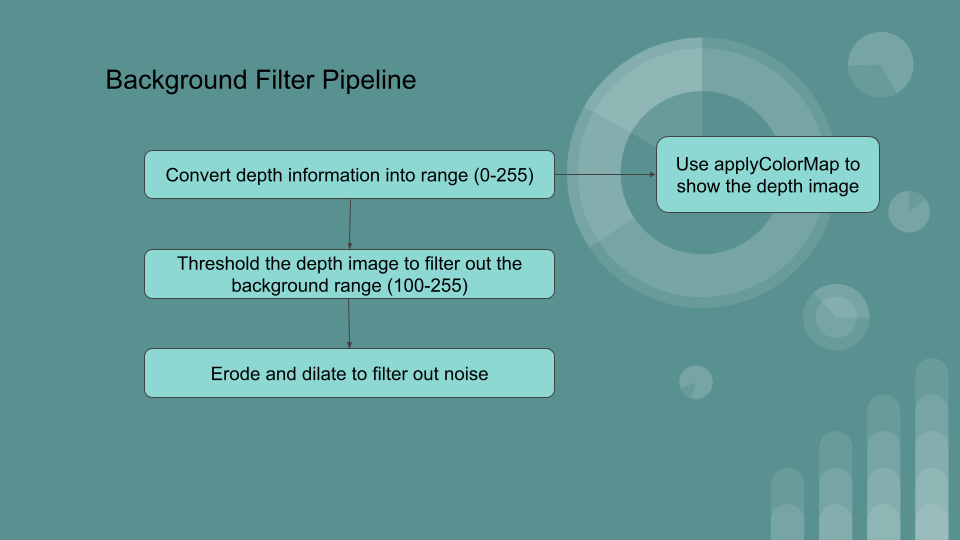

# Grass_Segmentation
This project is to do a simple segmentation for the farmbot. When farmbot moves outdoor, it needs to do obstacle avoidance.   
However, grass is a kind of soft objects that farmbot can go through.  
If only apply for obstacle avoidance, farmbot will think grass as an obstacle it can't pass through.  
Therefore, this green filter is to ignore the green color from the camera to avoid this issue.  

## Hardware
In this project, we use Oak D Lite for the whole process. It doesn't include imu inside and require USB-C for power supply 900mA at 5V  
For depth perception, the baseline of OAK D Lite left and right camera is 7.5cm.   
The minimum detective distance is ~20cm (480p, [extended](https://docs.luxonis.com/projects/api/en/latest/components/nodes/stereo_depth/#currently-configurable-blocks)), ~35 (480p), and the maximum detective distance is ~19.1m.  
### Specification


## Pipeline
### Green Filter  
  
### Background Filter  
  
### Grass Segmentation   


## Installation
This project is based on [depthai-ros](https://github.com/luxonis/depthai-ros) with ROS2-Foxy.    
First of all, follow the above link install dependencies in depthai-ros and build the repository.  
Second, go under workspace/ros2/src/luxonis/depthai-ros-examples/depthai_examples/ros2_src and replace the rgb_video_subscriber.cpp  
Third, go under workspace/ros2/src/luxonis/depthai-ros-examples/depthai_examples and replace the CMakeLists.txt  
Finally, build the packages again, go under workspace/ros2 and type  
```bash
colcon build --packages-select depthai_examples
```

## Execute
To run the files, create two terminals. Both terminals should under the workspace/ros2  
choose one and type  
```bash
source install/setup.bash  
ros2 launch depthai_examples rgb_stereo_node.launch.py  
```
switch to another terminal and type  
```bash
source install/setup.bash
ros2 run depthai_examples rgb_subscriber_node
```

## Result
Publisher will publish rgb image and stereo information.  
Subscriber will show rgb image, depth image and green filtered image (binary image, white is green and others are black)    

https://user-images.githubusercontent.com/45909260/178341847-226bb57a-8e1c-4761-b4be-20c2ac6ce0a3.mp4

